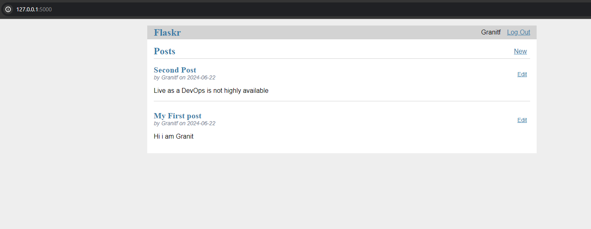

# terraform-test-project

1)  Dockerize (locally) simple web application (Feel free to find source in internet)
    + create dockerfile 
    + build docker image 
    + upload to docker registry

   For this test project i choose the Posts example application that Fask has inside its /examples/tutorial directory:
   https://github.com/pallets/flask/tree/main/examples/tutorial
   The Dockerfile is in this Repository main dir:
```
    FROM python:3.8-slim
    
    # Create a non-root user and group
    RUN groupadd -r appgroup && useradd -r -g appgroup appuser
    
    WORKDIR /app
    COPY . /app
    
    # Install dependencies
    RUN pip install --no-cache-dir -e .
    
    # Initialize the database
    RUN flask --app flaskr init-db
    
    # Change ownership to the non-root user
    RUN chown -R appuser:appgroup /app
    
    # Switch to the non-root user
    USER appuser
    
    # Expose the application port
    EXPOSE 5000
    
    # Set environment variables
    ENV FLASK_APP=flaskr
    ENV FLASK_ENV=development
    
    # Start the application
    ENTRYPOINT ["flask"]
    CMD ["run", "--host=0.0.0.0"]
```
  This image has been upload to my public repository on Docker hub: 
  Visit https://hub.docker.com/repository/docker/granitfazliudev/solab-app/general
  Running it locally looks like this:
  

2) Install and use terraform on free azure subscription to create a resource or service by choise.
      - Configure remote state (blob storage account).
3) Using Terraform, create and configure an AKS Cluster on Azure and deploy web application from the first task.

For point 2 and 3 we have the code in the repo that that parteins to terraform and when the application was deployed using GitHub Actions on AKS this is what it looks like ( exposed via loadbalancer type serviice external IP ):
 
The code is a bit messy when it comes to organization and deployment but it did the job :)

4)  Use by choice scripting language and do some file operations, like:
    Write text to file.
    Copy content of one file to another.
    Filter content of file by choice, (example. count dots, lines, or find words starting with 'xyz*').
S
